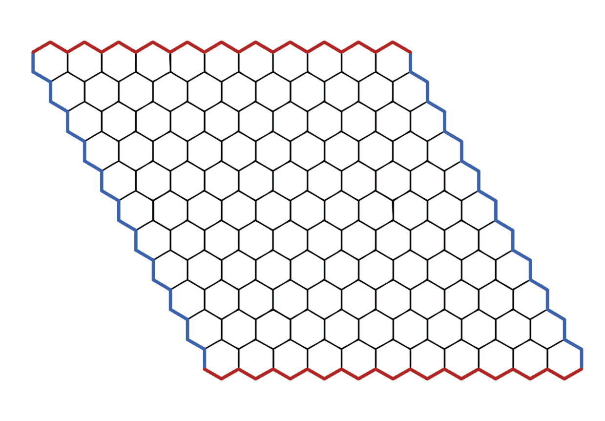

# sHEXpeare_PROP
## Proyecto final de PROP EPSEVG 2024 - 2025
#### Creadores:
- *Eric Millan Lombarte*
- *Marc Puertas Riba*

### Hex Game
*Hex* es un juego de mesa de *suma 0* con *"perfect information"*

##### Tablero
*Hex* es jugado en un tablero hecho de hexágonos. El mismo tablero tiene forma de rombo, como se muestra en la imagen. Las fichas se sitúan en los hexágonos del tablero. El tablero mostrado aquí tiene 11 fichas a cada lado del rombo, lo cual es un tamaño común para jugadores experimentados, pero el juego puede ser jugado en tableros de cualquier tamaño.

##### Objetivo

El objetivo es hacer un camino con las fichas de tu color entre lados (del mismo color) opuestos del tablero. El jugador contrario intentara hacer una cadena entre los lados del otro color del tablero. La cadena no tiene que estar en línea recta, siempre que la cadena esté cerrada, es decir, las fichas se encuentran directamente una al lado de la otra. En el juego que se muestra a continuación, el azul ganó.

##### Reglas

> - Inicialmente el tablero está vacío.
> - A cada jugador se le asigna un color de fichas y dos laterales opuestos del tablero que tendrá que intentar conectar con sus fichas siguiendo las reglas del juego.
> - Los jugadores van colocando fichas por turnos sobre el tablero en casillas desocupadas.
> - Gana el primer jugador que consigue formar una línea de sus fichas que conecte sus dos laterales. 
> - No son posibles los empates.
> - Como el primer jugador tiene ventaja, se jugarán 2 partidas una con cada color de fichas.
